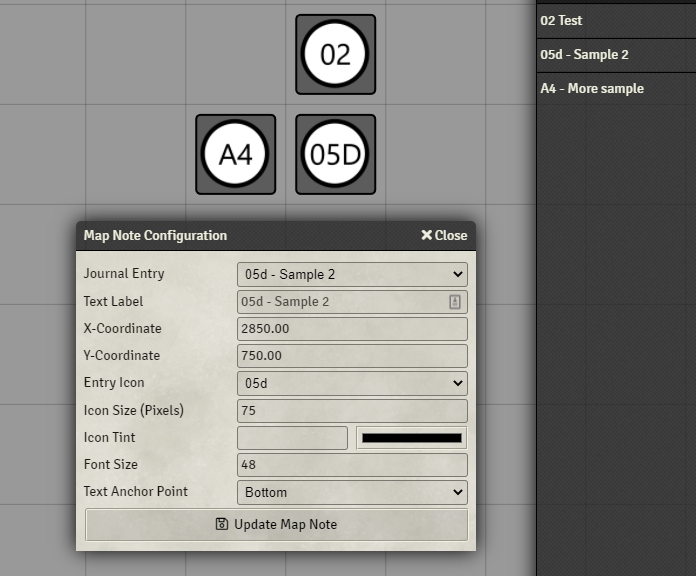

# Automatic journal Icon Numbers

This module will automatically apply numbered icons to journal entries that start with a number.  It supports the following numbering formats:
* [1-99]
* [A-Z][1-99]
* [1-99][A-Z]

For the single digit numbers, it support an option '0' padded format as well (i.e "A09", or "A9" )

To use, just drag correctly named journals to your map. The icon will be automatically selected to match the name.

The multiple styles seen in the example can be selected from the config menu.  

** As of 1.0.3, the icons are now generated dynamically and stored in uploads/journal-icon-numbers. It is advised the users of previous versions go through and edit all their icons to migrate to the new location.

Once I have proper migration tools in place, the old icons will be deleted since they slow down installs.

## Known issues

* If you rename a note, you need to re-edit it to get the new icon.
