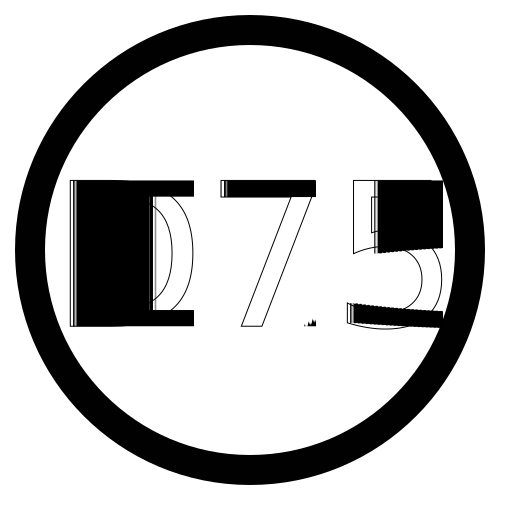

# Automatic journal Icon Numbers

This module will automatically apply numbered icons to journal entries that start with a number.  It supports the following numbering formats:
* [1-99]
* [A-Z][1-99]
* [1-99][A-Z]

For the single digit numbers, it support an option '0' padded format as well (i.e "A09", or "A9" )

To use, just drag correctly named journals to your map. The icon will be automatically selected to match the name.

## Known issues
* Case sensitivy on labels, due to windows limitations. 
* If you rename a icon, you need to re-edit it to get the new icon.