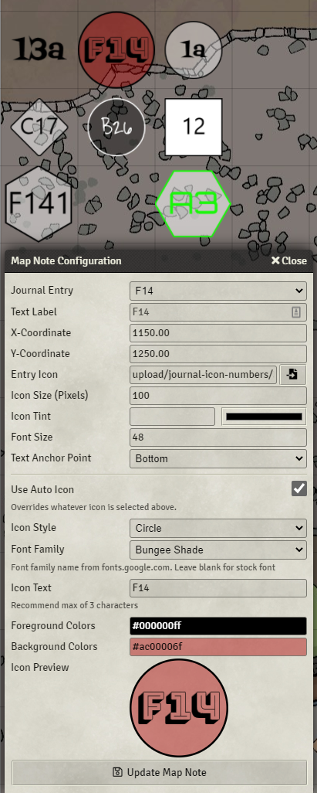

# Automatic Journal Icon Numbers

This module will automatically apply numbered icons (map pins) to journal entries that start with a number.  It supports the following numbering formats automatically:

* [1-99]
* [A-Z][1-99]
* [1-99][A-Z]

For the single digit numbers, it support an option '0' padded format as well (i.e "A09", or "A9" )

It is also now possible to manually specify arbitrary text in an icon; though a max of 3 characters is recommended for legibility. You can also disable the mod on specific pins if desired.

To use, just drag correctly named journals to your map. The icon will be automatically selected to match the name.

You can select a default global style of shape and color in the settings menu, and also override on a per-pin basis.

The above screenshot uses the [Backgroundless Pins](https://foundryvtt.com/packages/backgroundless-pins/) mod which is highly recommended.

## Compatiblilty
* Fully compatible with Pin Cushion

## Known issues

* None
